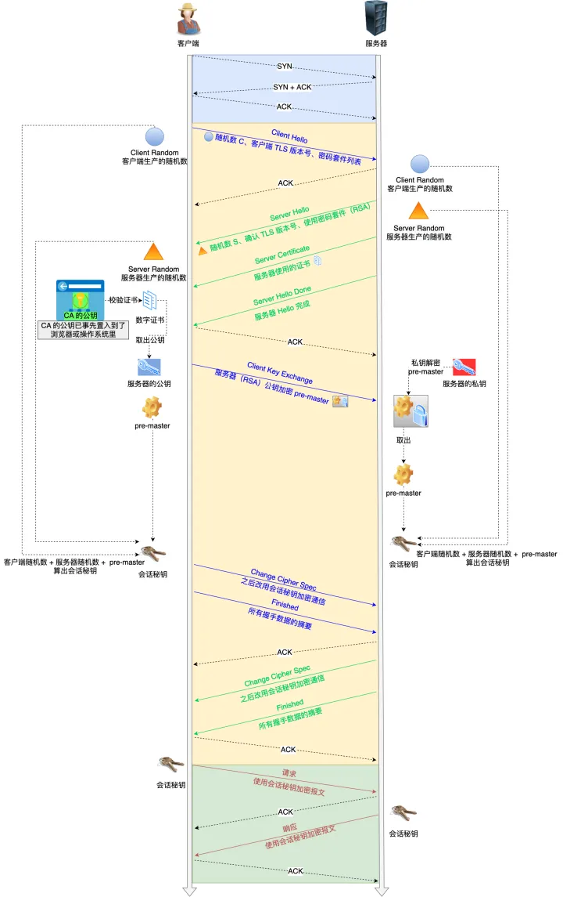

# https与证书

1. 查了很多资料，https握手还是要发证书
2. 如果不发，浏览器就不支持自定义私有证书，实际上是支持的。
3. 私钥没得说，不能泄露，只能放到服务器，用于服务端数据包加解密。
4. 浏览器本地有内置的证书签发机构对应的公钥，客户端使用公钥解密签名，然后自己计算hash看是否一致。
5. 握手是非对称加密， 传输是对称加密。   因为非对称加密消耗大。 webrtc的udp加密也是这么搞定的