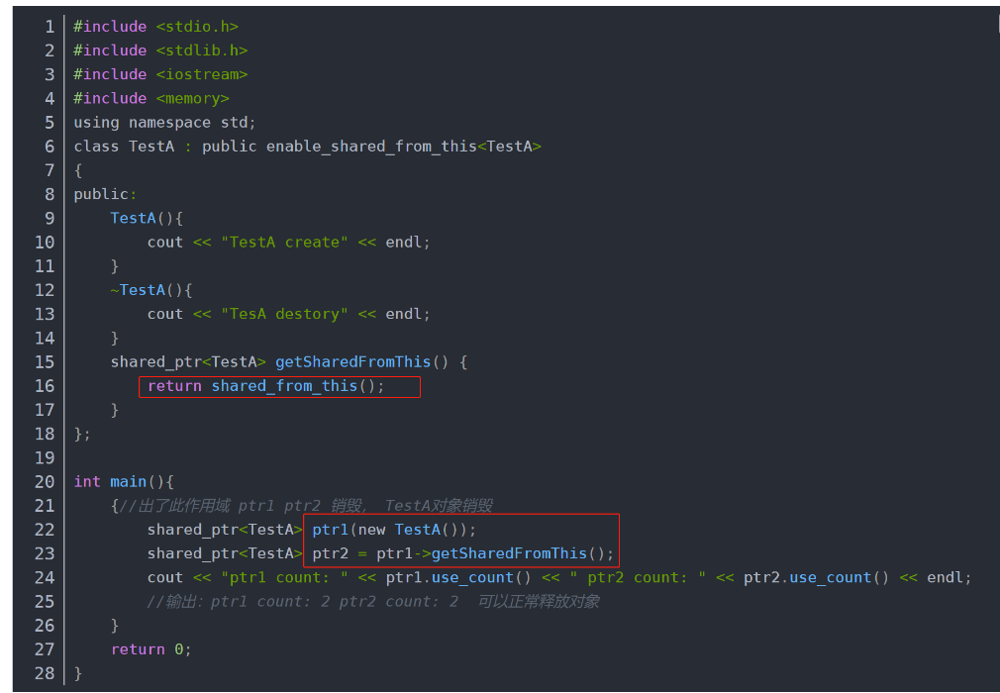
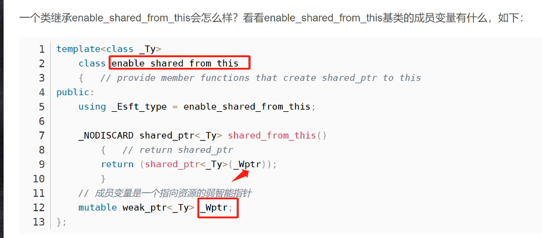
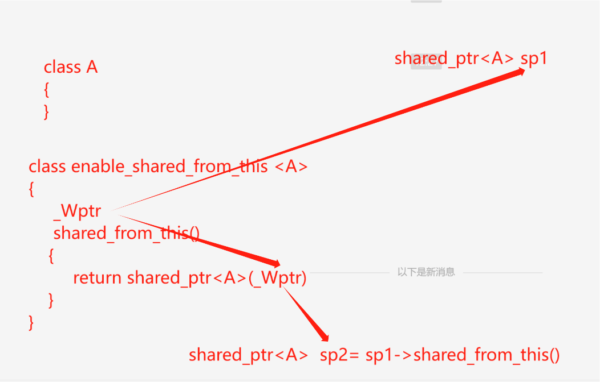

# c++的shared_ptr和shared_from_this为什么共享引用计数

## 一 引出问题

- 为什么ptr1和ptr2能共享引用计数？
- 注意：这样写没有问题，这里只是探讨内部实现。

## 二 原理
1. shared_from_this定义了一个_Wptr指向shared_ptr来传递引用计数，从而实现共享
1.  shared_ptr的默认构造函数会初始化_Wptr指向shared_ptr
2.  shared_from_this构造shared_ptr会传递_Wptr，就实现了共享应用计数。
3.  来源参考：https://blog.csdn.net/qq_42500831/article/details/124712080

## 三 结论
1. shared_ptr和shared_from_this共享引用计数。
2. shared_from_this的this本身必须已经是一个shared_ptr管理的指针。
1. 如A* p = new TestA()，调用p的shared_from_this会奔溃。
3. 也就是share_ptr专门针对enable_shared_from_this做了支持
4. 一个不太准确的图
