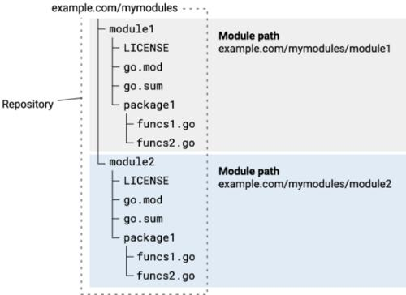

# golang开发记录

### goland配置protobuf
1. 安装GenProtobuf(W David Oldford)插件，既可以在goland快速生成
2. protoc-gen-go.exe安装到$GOPATH/bin: go install github.com/golang/protobuf/protoc-gen-go@latest
3. potoc.exe安装到$GOPATH/bin或者$PATH: 从官网下载
4. GenProtobuf配置全局参数：--go_out=plugins=grpc:.

### goland快捷键 http://t.zoukankan.com/gongxianjin-p-15513376.html
    ```
    5 简单重构
    Shift + F6 : 重命名
    Ctrl+Alt+M：抽取函数
    Ctrl+Alt+V：抽取变量
    ```

### 1. go的资源
- 官网：https://go.dev/
- 文档：https://go.dev/doc/
- 包：https://pkg.go.dev/

### 2. go的安装
1. windows和mac，下载安装包安装。
2. linux下载压缩包，解压后设置环境变量。
    ```
    wget https://go.dev/dl/go1.17.3.linux-amd64.tar.gz
   
    tar -zxvf go1.17.3.linux-amd64.tar.gz
   
    mv  go /usr/local/

    echo "export GOROOT=/usr/local/go" >>~/.bash_profile
    echo "export PATH=$PATH:$GOROOT/bin" >>~/.bash_profile
   
    source ~/.bash_profile
    ```
### 3. 基本知识
1. 新版不在需要手动配置GOPATH, 默认在用户目录下。
2. 采用mod管理项目。依赖库默认下载到GOPATH的pkg目录。
3. 配置go代理：go env -w GOPROXY=https://goproxy.cn,direct

### 4. 仓库-模块-目录/包-文件-变量-函数

1. 模块是 go 包的集合。
2. 包是 .go 文件的目录。
    - 一系列go文件的集合。
    - 一个文件夹下只能有一个package。
    - 不同文件夹package不能有重复。
    - 习惯将包名和目录名保证一致，但这不是强制规定。
3. import
    - import 导入的参数是路径，而非包名
    - 在代码中引用包成员时，使用包名而非目录名；

### 5. 项目管理（模块管理）
    ```
    go version
    go help
    go help mod
    
    go mod init github.com/xiaozhu/hello     // 指定名称，创建 module
    go get                                   // 安装缺少的依赖
    go get "xxx@v1.0.0"                      // 指定版本安装依赖
    go build [单go文件 | go文件列表 | 目录 | 包名]
    
    go mode tidy                                  // 安装缺少的依赖，清理无用的依赖
    
    go list -m all 打印当前模块的依赖项。
    go list -m -versions 模块名（查看某模块的所有版本）
    go test
    
    import "github.com/xiaozhu/hello"        // 使用
    ```

### go的交叉编译

    ```
    go tool dist list

    go env -w GOARCH=amd64
    go env -w GOOS=windows
    go build
    
    go env -w GOARCH=amd64
    go env -w GOOS=linux
    go build
    ```

### 6. 远程调试 dlv,ssh
1. ssh : https://www.cnblogs.com/haima/p/16298440.html
2. https://blog.csdn.net/u014763610/article/details/124367647

### 7. 技术细节
 - 关于context：https://blog.csdn.net/weixin_45994575/article/details/123314937

## 相关技术
1. go的优雅退出：https://blog.51cto.com/u_15912066/5935951
2. pprof：go tool pprof -http=:9999 cpu.pprof
   - https://blog.csdn.net/winfield821/article/details/104186306
   - https://blog.csdn.net/K346K346/article/details/104370334


 
