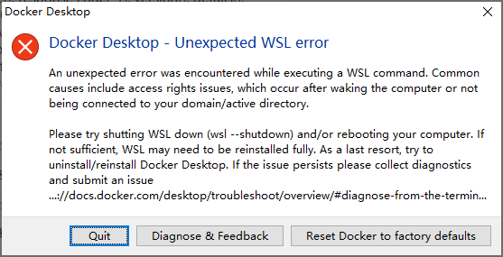

# WSL-windows子系统
>轻量级的linux和方便程序调试

## 一. 用WSL调试linux c++程序
1. Clion可以直接使用WSL的工具，非远程的
2. Clion配置工具链和终端

## 二. 安装WSL
1. 从应用商店安装
2. 手动安装
   - windows勾选hyper-v
   - https://zhuanlan.zhihu.com/p/629314758
   - https://learn.microsoft.com/zh-cn/windows/wsl/install-manual#step-4---download-the-linux-kernel-update-package
   - 错误1解决：https://blog.51cto.com/u_14011026/6192555
   - 错误2解决：https://www.zhihu.com/question/492599940
3. 安装windows terminal
   - https://github.com/microsoft/terminal
   - 为windows terminal 设置path: C:\Users\MoMing\AppData\Local\Microsoft\WindowsApps
4. 安装centos
    - https://www.cnblogs.com/fengjq/p/17581458.html
    - https://zhuanlan.zhihu.com/p/664780958
    - https://github.com/mishamosher/CentOS-WSL 
    - yum install make automake gcc gcc-c++ cmake gdb
5. 卸载
    - wsl --list --verbose
    - wsl --terminate CentOS7
    - wsl --unregister CentOS7
## 三：windows安装docker
1. 方式1(使用此方式)：
   - https://learn.microsoft.com/zh-cn/windows/wsl/tutorials/wsl-containers
   - https://docs.docker.com/desktop/wsl/#download
   - 错误解决：https://blog.csdn.net/ruoxuer/article/details/134768614
   
2. 方式2：
   - Install Docker in WSL 2 without Docker Desktop ― Nick Janetakis

