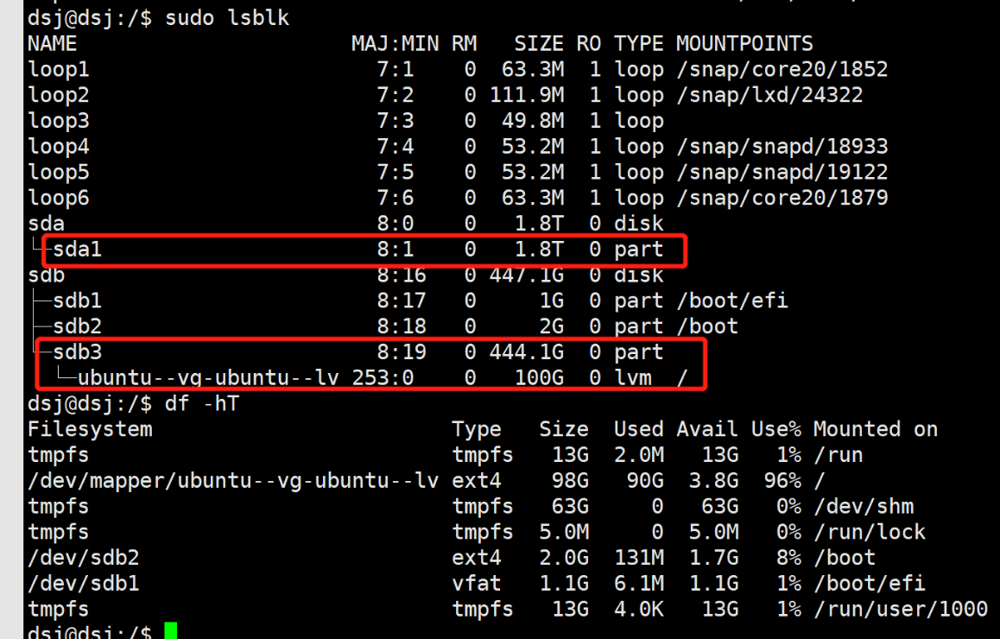

# linux硬盘管理之分区格式化挂载
先看一个简要步骤
```
1、fdisk -l查看磁盘情况，找到未挂载未分区的磁盘，一般为/dev/vdb
2、对数据盘进行分区 fdisk /dev/vdb
3、依次输入n,p,1,两次回车,wq 开始自动分区。操作完成后再用fdisk -l查看时，会出现/dev/vdb1的分区
4、创建一个文件夹用于挂载分区，mkdir /data
5、格式化分区 mkfs.ext3 /dev/vdb1
6、挂载新分区数据盘 mount /dev/vdb1 /data
7、查看分区，检查是否挂载成功 df -h
```

## 一. 查看信息
1. 查看磁盘数量和磁盘分区
```sudo lsblk```
2. 查看硬盘分区
```sudo fdisk -l```
3. 查看所有挂载点使用情况
```df -hT```
4. 查看挂载
```mount```
5. 查看目录使用情况
```du -h```

## 二. 分区格式化挂载
1. 分区
   ``` 
    fdisk /dev/vdb
    依次输入n,p,1,两次回车,wq 开始自动分区
   ```
2. 格式化
   ```
   sudo mkfs -t ext4 /dev/sdb5
   ```
3. 挂载
   ```
   sudo mount /dev/sdb5 /home/mason/
   sudo umount /home/mason
   ```

## 三. 关于lvm 

1. 我现在sdb3无法挂载，导致还有300G硬盘空间无法使用，怎么挂载或者扩展lvm？
    - https://www.dianjilingqu.com/383469.html
2.另外一个硬盘sda1怎么加入lvm
    - http://www.meilongkui.com/archives/2933
    - https://blog.csdn.net/Thewei666/article/details/129061923
    - https://www.cnblogs.com/large-show/p/16203274.html
    - https://baijiahao.baidu.com/s?id=1732310636276361384&wfr=spider&for=pc