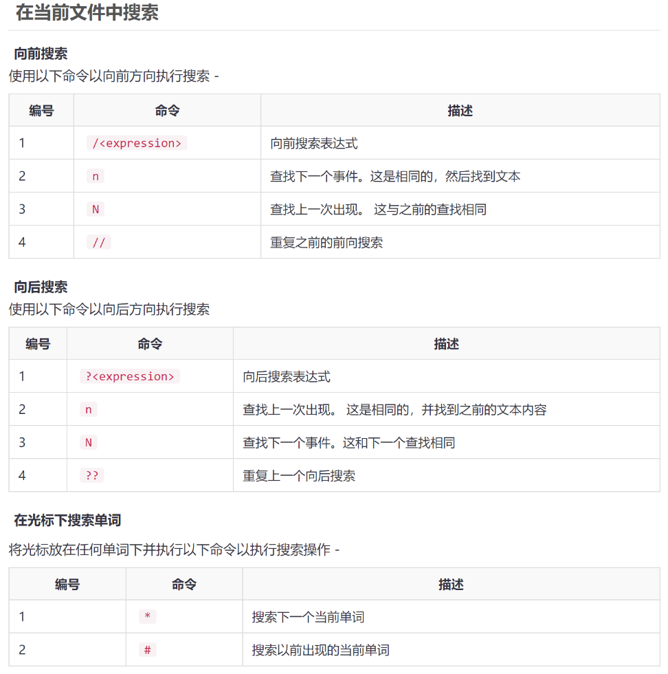

# vim的使用

## 一. 配置
```
:set number
echo "set nu" >> ~/.vimrc && cat  ~/.vimrc
```

## 二. 跳转到行
1. 命令行模式下输入（n为指定的行号）：
    - （1）12gg / 12G
    - （2）:12 + 回车键
    - （3）打开文件时输入vim +12 filename
1. 命令行模式跳转到文首/文末:
   - 文首：按gg（区分大小写）
   - 文末：按G（区分大小写）
1. 命令行模式跳转到行首/行末
   - 行首：①按Home  ②按0（数字0）
   - 行尾：①按End   ②按$（Shift + 4）
1. 命令行模式跳转到指定列
   - 输入 n| 或 0n| 命令（0 代表数字0，n 代表行号，| 代表竖杆符号）
1. 文本中想查看当前行信息，可输入： Ctrl + g   
## 三. 搜索

https://www.yiibai.com/vim/vim_searching.html

## 四. 复制剪切粘贴撤销:yy dd p u
1. 复制：
   - 复制一行则：yy
   - 复制三行则：3yy，即从当前光标+下两行。
   - 复制当前光标所在的位置到行尾：y$
   - 复制当前光标所在的位置到行首：y^
2. 剪切：
   - 剪切一行：dd
   - 前切三行：3dd,即从当前行+下两行被剪切了。
   - 剪切当前行光标所在的位置到行尾：d$
   - 剪切当前行光标所在的位置到行首：d^
3. 粘贴：
   - 用v选中文本之后可以按y进行复制，如果按d就表示剪切，之后按p进行粘贴。
4. 撤销与恢复：
   - 'u' : 撤销上一个编辑操作
   - 'ctrl + r' : 恢复，即回退前一个命令
   - 'U' : 行撤销，撤销所有在前一个编辑行上的操作

