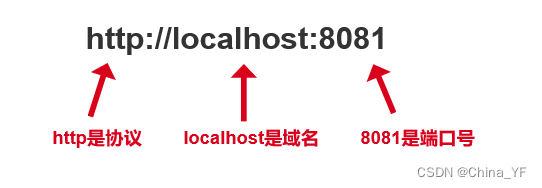

# web跨域解决方案
> 如果目标资源的服务不能配置，就只能代理，其他方式要改页面搞乱页面。

## 一. 什么是跨域？
跨域就是当在页面上发送ajax请求时，由于浏览器同源策略的限制，要求当前页面和服务端必须同源，也就是协议、域名和端口号必须一致。

## 二. 解决方案
1. CORS：目标资源服务指定可以谁访问
3. 搭建Node代理服务器
4. Nginx反向代理
5. JSONP
5. postMessage 
6. Websocket
https://blog.csdn.net/m0_37873510/article/details/126558023

